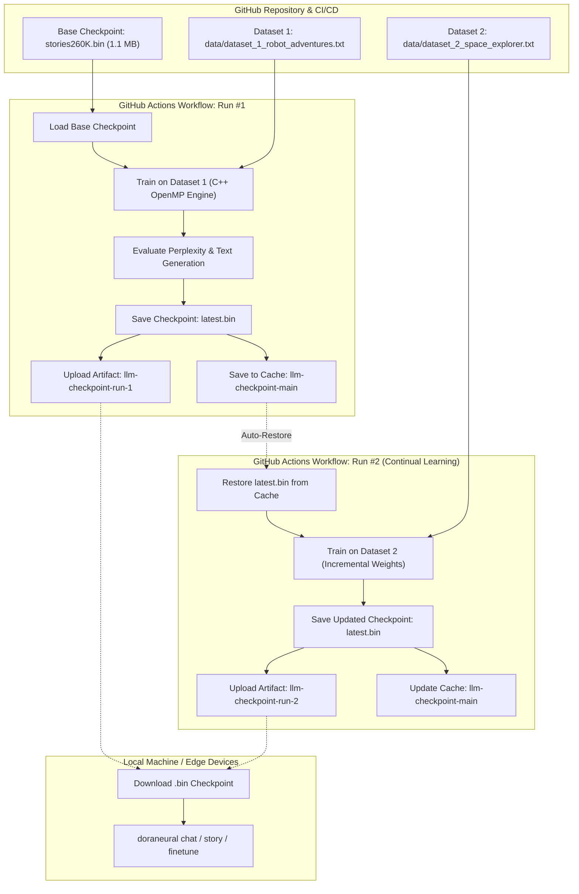

# 🚀 Continuous LLM Training with GitHub Actions & Automated Checkpointing

This guide details how to train and continuously fine-tune LLaMA models directly within GitHub Actions, outputting trained model weights (`.bin` files) as downloadable artifacts and automatically chaining checkpoints across successive training runs with new datasets.

---

## 🔄 The Continuous Training Loop Architecture



---

## ⚙️ How It Works

### 1. Checkpoint Chaining (`actions/cache` & `checkpoints/latest.bin`)
- Each workflow run saves the updated weights to `checkpoints/latest.bin`.
- The directory `checkpoints/` is saved into the GitHub Actions Cache (`actions/cache/save@v4`) keyed by `llm-checkpoint-${{ github.ref_name }}`.
- When the next run executes (either manually or upon pushing new files to `data/`), `actions/cache/restore@v4` automatically pulls `checkpoints/latest.bin`.
- The training runner script detects `checkpoints/latest.bin` and continues training seamlessly from where the previous run left off!

### 2. Downloadable Workflow Artifacts
- Every single training run uploads a versioned GitHub Actions artifact:
  - **Artifact Name:** `llm-checkpoint-run-<RUN_NUMBER>`
  - **Contents:**
    - `checkpoints/latest.bin` (Latest active weights)
    - `checkpoints/model_<RUN_ID>.bin` (Immutable timestamped snapshot)
    - `checkpoints/checkpoint_meta.json` (Full training lineage, parent checkpoint, training duration, loss curve, before/after generated texts)

### 3. Native C++ Acceleration in Runners
- Uses Ubuntu runners (`ubuntu-latest`) with `g++` and OpenMP multi-threading.
- Automatically compiles `doraneural/csrc/llm_engine.cpp` with `-O3 -fopenmp` flags.
- Trains 20x to 50x faster than pure Python.

---

## 🎯 How to Run

### Method A: Manual Trigger via GitHub UI (`workflow_dispatch`)
1. Go to the **Actions** tab in your GitHub repository.
2. Select **Train LLM & Continual Checkpointing** on the left.
3. Click **Run workflow**:
   - **Auto-download dataset from Hugging Face:** `roneneldan/TinyStories` (or any Hugging Face repo ID / URL).
   - **Max samples from Hugging Face:** `100` (e.g. 100 stories).
   - **Resume training from previous run checkpoint in cache:** `true`.
   - **Number of training epochs:** `5`.
   - **Learning rate:** `0.0005`.
   - **Test prompt:** `Once upon a time, there was a little robot`.
4. Click **Run workflow**.

> [!TIP]
> You do **not** need to download datasets to your computer or commit large text files to git! Just type the Hugging Face dataset repository name into the workflow input, and GitHub Actions will download, parse, and train on it directly in the cloud.

### Method B: Automated Trigger on Git Push
Whenever you push new text files to `data/`:
```bash
echo "Sparky learned how to decode pulsar signals..." >> data/dataset_3_pulsars.txt
git add data/dataset_3_pulsars.txt
git commit -m "data: add pulsar dataset for continuous training"
git push
```
GitHub Actions will automatically trigger, restore the latest model weights, train on the new dataset, and upload the new checkpoint!

---

## 💻 Running Continual Training Locally

You can run the exact same continuous training engine locally:

### Train on Dataset 1:
```bash
python scripts/train_llm.py \
  --data data/dataset_1_robot_adventures.txt \
  --output-dir checkpoints \
  --epochs 5 \
  --lr 5e-4
```

### Continual Training on Dataset 2 (Auto-Resumes from `checkpoints/latest.bin`):
```bash
python scripts/train_llm.py \
  --data data/dataset_2_space_explorer.txt \
  --output-dir checkpoints \
  --epochs 5 \
  --lr 5e-4
```

### Train Directly on Hugging Face Datasets:
```bash
# Auto-downloads from Hugging Face and fine-tunes
python scripts/train_llm.py \
  --hf-dataset roneneldan/TinyStories \
  --hf-samples 20 \
  --epochs 3

# Or via the doraneural CLI:
doraneural finetune --data roneneldan/TinyStories --hf-samples 20 --epochs 3
```

### Chat or Generate with Your Trained Checkpoint:
```bash
# Using doraneural CLI
doraneural finetune --checkpoint checkpoints/latest.bin --data data/dataset_2_space_explorer.txt

# Or chat with the model using Python
python -c '
import doraneural as dn
llm = dn.LlamaLLM(model_path="checkpoints/latest.bin", tokenizer_path="models/stories260K/tok512.bin")
print(llm.generate("Once upon a time, there was a little robot", max_tokens=60))
'
```

---

## 📋 Checkpoint Metadata Receipt (`checkpoint_meta.json`)

Each checkpoint includes an auditable JSON receipt tracking the full genealogy of the model across runs:

```json
{
  "latest": {
    "run_id": "run_20260917_155639",
    "timestamp_utc": "2026-09-17T15:56:39Z",
    "parent_checkpoint": "Continued from: latest.bin",
    "dataset_name": "dataset_2_space_explorer.txt",
    "word_count": 160,
    "estimated_tokens": 592,
    "checkpoint_bytes": 1056540,
    "checkpoint_sha256": "17a9a6e244b85931...",
    "loss_history": [3.2945, 3.2945, 3.2945],
    "gen_before": "Once upon a time, there was a little robot named Grandma...",
    "gen_after": "Once upon a time, there was a little robot named Benny..."
  },
  "total_runs": 2,
  "runs": [...]
}
```
