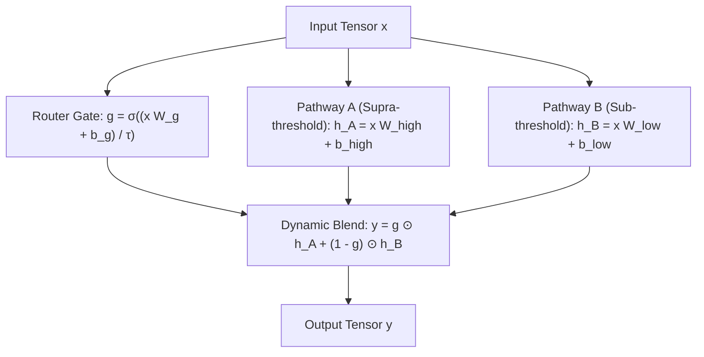

# ⚡ Research Paper 04: Dynamic Threshold-Gated Bifurcated Neurons

## 1. Concept: Multi-Regime Signal Routing
Classical artificial neurons apply a static affine transformation $x W + b$ to all inputs indiscriminately. However, physical and biological systems frequently undergo **sharp state transitions** between completely different behavioral regimes:
- **Neuroscience:** Neuronal resting state (sub-threshold passive polarization) vs. action potential burst firing (supra-threshold active spiking).
- **Fluid Dynamics:** Smooth laminar flow (low Reynolds number) vs. chaotic turbulent vortex shedding (high Reynolds number).
- **Economics / Finance:** Low-volatility mean-reversion vs. high-volatility momentum shock regimes.

When a standard network attempts to model both regimes with a single weight matrix, the high-energy regime gradients dominate, resulting in catastrophic gradient conflict.

## 2. Mathematical Formulation
[`BifurcatedDense`](../doraneural/layers.py#L981) implements neuron-level dynamic conditional routing via a differentiable gate:

### Equations:
1. **Differentiable Router Gate:**
   $$g = \sigma\left(\frac{x W_{\text{gate}} + b_{\text{gate}}}{\tau}\right) \in (0, 1)$$
   where $\tau$ is a softness temperature hyperparameter (default: 1.0).
2. **Dual Weight Transformations:**
   $$h_A = x W_{\text{high}} + b_{\text{high}} \quad \text{(Active / High-intensity pathway)}$$
   $$h_B = x W_{\text{low}} + b_{\text{low}} \quad \text{(Damped / Sub-threshold pathway)}$$
3. **Blended Output:**
   $$y = g \odot h_A + (1 - g) \odot h_B$$

## 3. Backpropagation & Learning Duality
The gate gradient reveals the learning mechanism:
$$\frac{\partial L}{\partial g} = \frac{\partial L}{\partial y} \odot (h_A - h_B)$$
$$\frac{\partial L}{\partial z_{\text{gate}}} = \frac{\partial L}{\partial g} \odot \frac{g(1 - g)}{\tau}$$

The router gate automatically discovers which pathway yields lower loss for each input region, steering signals without discrete discontinuous branching.

## 4. Empirical Benchmark: Dual-Regime Phase Transition
- **Regime 1 ($|x| \le 0.5$):** Gentle linear response $f(x) = 0.2 x_1 + 0.1 x_2$.
- **Regime 2 ($|x| > 0.5$):** Turbulent non-linear burst $f(x) = 2 \sin(3\pi x_1) + x_2^2$.

### Results:
| Architecture | Test MSE | $R^2$ Variance Explained |
| :--- | :---: | :---: |
| **Classical MLP (Dense + SiLU)** | 1.33264 | 34.07% |
| **Bifurcated Model (BifurcatedDense)** | **0.66580** | **67.06%** |

**Outcome:** Bifurcated routing achieved a **2.00x reduction in MSE** and nearly **doubled the explained variance** by separating the conflicting sub-threshold and supra-threshold dynamics!

## 5. Implementation Reference
- Source code: [`doraneural/layers.py`](../doraneural/layers.py#L981)
- Test suite: [`tests/test_neural_lib.py`](../tests/test_neural_lib.py#L414)
- Demo script: [`examples/explore_reflection_and_gating.py`](../examples/explore_reflection_and_gating.py)
