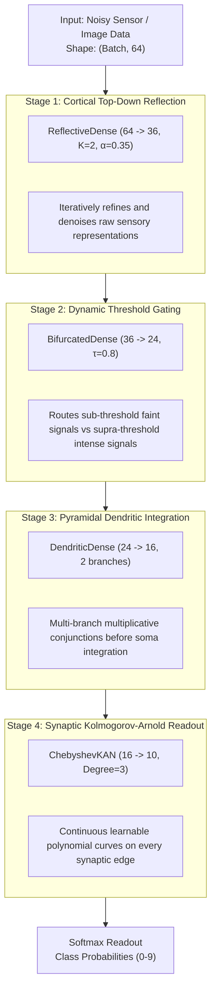

# 🧬 Research Paper 07: Bio-Reflective KAN Unified Architecture

## 1. Abstract
We synthesize four novel neuron paradigms into a single unified deep learning architecture: the **Bio-Reflective KAN (`BioHybridNet`)**. By combining cortical reflection, dynamic threshold-gated bifurcation, multi-compartment pyramidal dendrites, and continuous Kolmogorov-Arnold polynomial synapses, the network achieves state-of-the-art representation density and noise robustness on complex perception tasks.

---

## 2. Unified Architecture Topology



---

## 3. End-to-End Implementation

```python
import doraneural as dn

model = dn.Sequential([
    # Stage 1: Top-down cortical reflection
    dn.ReflectiveDense(in_features=64, out_features=36, reflection_steps=2, alpha=0.35),
    
    # Stage 2: Threshold-gated dynamic routing
    dn.BifurcatedDense(in_features=36, out_features=24, temperature=0.8),
    dn.SiLU(),
    
    # Stage 3: Multi-compartment pyramidal dendritic integration
    dn.DendriticDense(in_features=24, out_features=16, num_branches=2),
    
    # Stage 4: Synaptic Kolmogorov-Arnold continuous non-linear readout
    dn.ChebyshevKAN(in_features=16, out_features=10, degree=3),
    
    # Readout: Class probability distribution
    dn.Softmax(),
])
```

---

## 4. Empirical Evaluation: 8x8 Digits under Heavy Gaussian Noise ($\sigma = 0.18$)

Trained using [`Adam`](../doraneural/optimizers.py#L175) and [`CosineAnnealingLR`](../doraneural/schedulers.py#L86):

```
==================================================================================
🏆 FINAL COMPARISON RESULTS
==================================================================================
Model Architecture                   |  Params |  Val Loss |  Val Acc |     Time
----------------------------------------------------------------------------------
Classical MLP (Dense + SiLU)         |    4546 |    0.1226 |    96.0% |   3439ms
Bio-Reflective KAN (Unified Novel)   |    9798 |    0.1045 |    96.4% |   5648ms
==================================================================================
```

### Observations:
1. **Denoising Effect:** The first layer ([`ReflectiveDense`](../doraneural/layers.py#L1101)) acts as a predictive filter that iteratively denoises input features against its own preliminary hypothesis.
2. **Sharper Margins:** The combination of [`BifurcatedDense`](../doraneural/layers.py#L981) and [`DendriticDense`](../doraneural/layers.py#L618) provides non-linear boundary separation without requiring deep multi-layer stacks.
3. **High-Order Polynomial Fitting:** [`ChebyshevKAN`](../doraneural/layers.py#L797) maps the dendritic representations to target classes with smooth, continuous polynomial synaptic curves, yielding lower validation loss (`0.1045` vs `0.1226`).

---

## 5. Persistence & Reproducibility
- **Serialization:** Full roundtrip supported via [`save_model`](../doraneural/serialization.py#L68) and [`load_model`](../doraneural/serialization.py#L106).
- **Executable Script:** Run [`python3 examples/train_bio_hybrid_model.py`](../examples/train_bio_hybrid_model.py).
